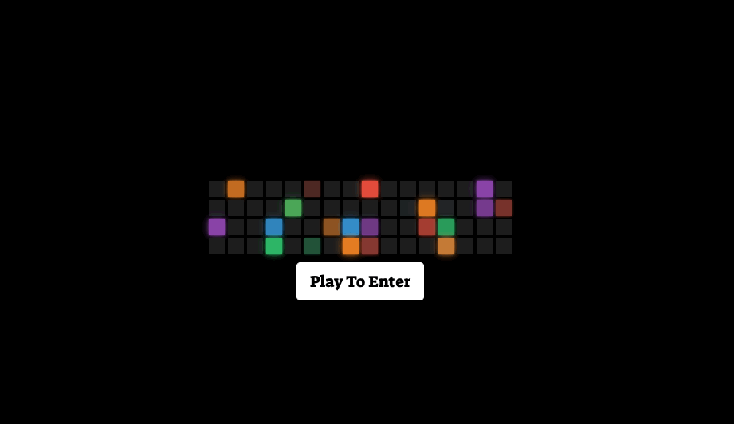

# curly-octo-guacamole

Assignment Summary: Portfolio Website Update #2

Developer: Mehdi Mehrabani

Portfolio Link: [Portfolio](https://mmehr1988.github.io/curly-octo-guacamole/)

For this weeks assignment, we were tasked with updating our initial portfolio website. The first time around, I was at the beginning of my bootcamp journey and there weren’t any actual projects I could highlight. Since then, I’ve learned many lessons that have resulted in frustration on some nights, but also exhilaration on other nights. The biggest lesson has been not to give up and just continue to research the problem until you have found a solution or a creative detour. It’s in these scenarios that I’ve learned the most.

The accumulation of all these late nights have resulted in the completion of multiple projects that I’m proud of and want future employers to view. Looking back, I fully understand the importance of each assignment and how each one contributes to the learning of coding fundamentals.

Before attempting to build the first iteration of what my potential portfolio will look like, I went online to research the importance of a web developers’ portfolio. I took this assignment as an opportunity to test the things I’ve learned from both the bootcamp and self-study.

In summary, a web developers’ portfolio should at minimum have 3 sections:

1. About Me: Who are you?
2. Projects: What can you do?
3. Contact Me: How can we reach?

For more information, check out [Ultimate Guide to Creating a Programmer Portfolio](https://www.springboard.com/blog/careersmithing/programmer-portfolio/).

Applying the same methodology as I did the first time, I wanted to use this opportunity to allow myself to try out the new skills that I’ve acquired since then.

It should be noted that I could have simply kept my portfolio very similar to the first iteration but that would be playing it safe. These assignments are testing ground for new ideas and I wanted to make sure no matter what, I stay true to who I am.

# Summary of Assignment

## Resources used to complete this assignment:

1. Bootcamp
2. Udemy
3. GoogleDev Tools
4. Bootstrap
5. Jquery
6. Youtube
7. Ableton [Digital Audio Workstation]
8. Stackoverflow

# Steps Taken to Complete Assignment

### Initial Steps

1. Review Homework Requirements
2. Find Inspiration
3. Choose CSS Framework
4. Choose Fonts & Color Theme
5. Gather Learning Material
6. Wireframing
7. Create Files & Structure Folder

## Homework Requirements

Update Portfolio To Showcase Completed Projects

### Requirement #1: Update Portfolio To Showcase Bootcamp Coursework

The first requirement for this assignment is to update our portfolio to showcase at least 2 assignments and our first project. Should be noted that we’ve completed a total of 4 assignments and 1 group project since our first portfolio iteration.

#### Assignments + Project Chosen

1. Project 1: DAHM

   a. Summary Of Project: Digital mixer which uses four imported youtube and allows users to adjust video parameters to create unique sounds.

   b. Github Repo: symmetrical-waddle

   c. Github Repository Link: [symmetrical-waddle Repo](https://github.com/mmehr1988/symmetrical-waddle)

   d. Github App Link: [symmetrical-waddle App](https://mmehr1988.github.io/symmetrical-waddle/)

2. Assignment 1: Code Quiz

   a. Summary Of Project: An app that cycles through questions and records user answers and outputs a score based on the time taken to complete quiz.

   b. Github Repo: miniature-telegram

   c. Github Repository Link: [miniature-telegram Repo](https://github.com/mmehr1988/miniature-telegram)

   d. Github App Link: [miniature-telegram App](https://mmehr1988.github.io/miniature-telegram/)

3. Assignment 2: Weather App

   a. Summary: A weather dashboard created using third party API which allows users to input city in which they want to get weather data.

   b. Github Repo: legendary-meme

   c. Github Repository Link: [legendary-meme Repo](https://github.com/mmehr1988/legendary-meme)

   d. Github App Link: [legendary-meme App](https://mmehr1988.github.io/legendary-meme/)

### Requirement #2: Update Github Profile

The second requirement for this assignment is to take time and polish up our Github pages. Since employers will inevitably use our Github page to get to know potential future hires, this task should not be underestimated.

#### Github Page Updates

1. Update Profile – I love the idea of an avatar, and decided to update my profile photo with an Avatar that looks similar.

2. Biography – I didn’t want to write a story here. I decided to state where in the coding world I place myself and what my passion in life is. The result being, “Full stack developer who loves telling stories with sound.”

3. Github Profile README – While researching unique profiles to get inspiration, I came across this process of using a README.md as a message board.

   a. Badges For Github README Profile: In addition, the below Github repo walks you through how to add badges to your profile page. Found this to be extremely useful when combined with an `<a>` you can redirect users to your specific profiles on various platforms.

   b. [Welcome! Badges 4 README.md Profile](https://github.com/alexandresanlim/Badges4-README.md-Profile)

4. Historical Assignment File Updates – gitignore + MIT LICENSE

   a. gitignore: I recently learned the purpose of a gitignore file and how to ignore the macOS specific .DS_Store upon pushing repository updates. Having only included the file for our group project, I decided for consistency purposes to do the same for all previous repositories.

   b. MIT LICENSE: This will be my first time reading about the MIT License document and why someone would want to include it in their repository. I’m definitely the type of person that would want others to benefit from the products I make so this was a plus on the legal side of things. For the same reason as the gitignore file, I decided to go back and include the license for all previous assignments.

## Find Inspiration

What makes me get up and learn coding is the idea that one day I can utilize what I’ve learned to create things relate to audio / sound. More specifically, I want to learn how to use AI in the creation of sound. I know it’ll take some time until I feel comfortable to venture off into that domain, but if there is one book that has inspired me recently it’s “The Artist In The Machine” by Arthur I. Miller. The book essentially highlights the various moments in history where computers have been used to create art. It tries to answer the question of whether computers can be creative?

I’ll reserve my opinion for another time, but the important takeaway is to allow yourself to want to be surprised.

If you’re interested, here is the link to the about page [About The Artist in the Machine](https://www.artistinthemachine.net/about/).

For the reasons above, I wanted to use sound in some sort of fashion when building my portfolio.

Per my research on portfolio design, I did not come across many developers utilizing a loading page, but for me it fit perfect.

First, if someone decides to use a loading page, it better be creative or you’re just wasting time. Second, if it so happens to be creative and the employer viewing it doesn’t want to wait and watch, then you and that employer aren’t meant to be.

Working through some Udemy courses, there was a project that showed how to create a block of small squares to light up with a random color whenever the users mouse moved across the square. I must have spent a good half hour just moving my mouse over the squares before thinking if there was a way to trigger sounds along with the colors. I started researching and realized there actually are ways and began to figure out how to code the two together.

In summary, I used Ableton to trigger a midi piano instrument to record piano notes. Each recording would represent a square block. When user pulls my portfolio up for the first time, there is a button that user needs to click on in order to gain access to my portfolio. I then created a random triggering function to choose a number between 1 & 64. Whenever a square gets triggered the color and the piano note associated with the square will continue to play until all the 64 squares have lit up. The audio generated is listening to a piano when all keys are being hit together. This is when user automatically gets redirected to my portfolios main page. To some this might be nothing special, but for me, this was everything.

See below GIF showcasing the music square color landing page.

### Portfolio Landing Page GIF

## CSS Framework: Bootstrap 5.0

Up until recently, I’ve forced myself to use pure CSS styling for all my work just to learn the blueprint of styling with pure CSS. However, with each passing week the assignments are demanding more time to be spent on the Javascript side and as a result I’ve had to start utilizing CSS frameworks to make up for the lost time.

For this iteration of my portfolio I’ve decided to go with Bootstrap 5.0. On their website getting started page, they have a download package with a bunch of templates that users can utilize as a starting point. Links below.

Bootstrap Website [Build fast, responsive sites with Bootstrap](https://getbootstrap.com/)

Bootstrap Getting Started Page [Download Page](https://getbootstrap.com/docs/5.0/getting-started/download/)

Bootstrap Template Download Link [Bootstrap Templates]](https://github.com/twbs/bootstrap/releases/download/v5.0.2/bootstrap-5.0.2-dist.zip)

I initially thought these types of CSS Frameworks would be able to solve any problem, however I soon learned that not everything is handed to you. Mistakes have been made when creating certain elements, and I’m ok with that. I know with time I will get better at using these frameworks, but the point is to force yourself to learn.

## Choose Fonts & Color Theme

I’ve been using google fonts family “Suez One” styling for the past couple of assignments and for me it just gives a playful feel that I relate to. In terms of color, I really enjoy playing around with color combo’s.

1. NAV: For the Nav Bar, I used a purple color. I didn’t want to go with the usual black or white and for me purple just did the job.

2. Section Titles: mustard yellow

3. About Content: I used a combo of pink and green. Green just signifies peace and pink just takes you back to a childish like feeling.

4. Dark & Light Mode: I’ve seen on many websites where they’ve used a button to allow users to either view their webpage in dark or light mode. I wanted to learn how they did this so I decided the best way to learn is to try to implement it. For this reason, at the end of the nav bar, I incorporated a button to allow users to switch between dark and light mode.

5. Icon Colors vs. Contact Page: Instead of using plain writing to provide contact information. I decided to utilize icons to take user to my contact information pages. For each icon I researched the color code. For example, LinkedIn hex code is #006192.

## File Structure

1. File: Index.html
2. File: LICENSE
3. File: README.md
4. Folder: assets

   a. Folder: audio

   - All piano audio file recording used for landing page

   b. Folder: css

   - File: style.css

   - File: queries.css

   c. Folder: documents

   - File: resume

   d. Folder: gifs

   - File: gif of portfolio

   e. Folder: img

   - Folder: avatar

     - File: A 200x200 avatar photo used in personal portfolio

   f. Folder: js

   - File: script.js

5. Folder: vendors

   - File: normalize.css

## Process Of Writing

1.  `<head>`

    - In the head of the document you will find the following `<link>`

      a. Bootstrap 5.0
      b. Jquery
      c. Google Fonts
      d. Normalize CSS
      e. style.css
      f. queries.css

2.  `<section>` | Page Load

    - The page load is separated into two components. The first is related to the square colors and the second are the buttons allowing user to enter the portfolio page.

    - Coding Square Colors + Audio

      a. DOMContentLoaded + `function init()` - Created an addEventlistener to run a function called init. The init function is a for loop that appends elements in the DOM for both the square colors and audio elements.
