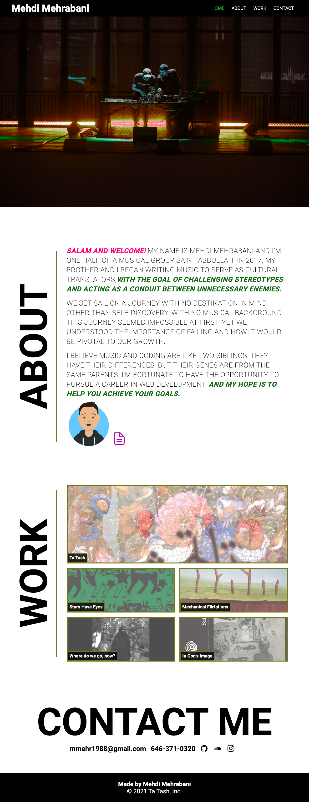

# curly-octo-guacamole

Assignment Summary: Portfolio Website

Developer: Mehdi Mehrabani

Time Spent To Complete: 1 Long Week

I understand this README.md file is supposed to be a summary of the work that went into completing this assignment, but for me this assignment was much more.

This assignment gave me a glimpse of the answer I’ve been looking for to the question I’ve asked myself a million times over: why did you quit your well-paying job in finance? It’s because I want to be a creative. I want to be able to use my creative side more than my robotic side.

Before attempting to build the first iteration of what my potential portfolio will look like, I went online to research the importance of a web developers portfolio.

I came across a blog post which did a fantastic job at highlighting some of the questions I had.

What is a web developers’ portfolio?

In summary, a web developers’ portfolio should at minimum have 3 sections:

1. About Me: Who are you?
2. Projects: What can you do?
3. Contact Me: How can we reach?

For more information, check out [Ultimate Guide to Creating a Programmer Portfolio](https://www.springboard.com/blog/careersmithing/programmer-portfolio/).

Since I’m only starting this journey in becoming a web developer, I currently do not have any projects under my belt. Instead, I decided to use this opportunity to highlight my second love of my life which is music. The first being my wife.

I took this assignment as an opportunity to test the things I’ve learned from both the bootcamp and self-study.

# Summary of Assignment

Up until this assignment we’ve learned flexbox, media queries, and CSS variables. I also took an attempt at building what is commonly known as a “sticky navigation”. Although it was not asked, I believe by attempting to build it out, I’m allowing myself to fail.

## Resources used to complete this assignment:

1. Bootcamp
2. Udemy
3. GoogleDev Tools
4. Youtube

What is Flexbox Layout? Flexbox Layout is “a more efficient way to lay out, align and distribute space among items in a container, even when their size is unknown and/or dynamic (thus the word “flex”)”

For more information, check out [A Complete Guide to Flexbox](https://css-tricks.com/snippets/css/a-guide-to-flexbox/#background).

What are media queries? Media queries are methods used to “modify your site or app depending on a device's general type (such as print vs. screen)”

For more information, check out [Using media queries](https://developer.mozilla.org/en-US/docs/Web/CSS/Media_Queries/Using_media_queries).

What are CSS variables? CSS variables “are entities defined by CSS authors that contain specific values to be reused throughout a document.”

For more information, check out [Using CSS custom properties (variables)](https://developer.mozilla.org/en-US/docs/Web/CSS/Using_CSS_custom_properties).

# Steps Taken to Complete Assignment

## Initial Steps

1. Find Inspiration
2. Choose Fonts & Colors
3. Review homework README.md
4. Gather Learning Material
5. Wireframing
6. Create Files & Structure Folder

## Structure + Process of Writing Code

Through-out the process of writing the code, I made sure to utilize the Flexbox layout.

## HTML Structure

1. Header
   a. `<header>`
   b. `<nav>`
2. Website Background Image
   a. `<figure>`
3. Main Body Section
   a. `<main>`
   b. `<section>` - 3 generic section elements to separate my About, Work, Contact sections
   c. `<article>`
4. Footer
   a. `<footer>`

## Summary of Code: HTML, CSS, Javascript

### Header

1.  Name Of Website – Mehdi Mehrabani

2.  Navigation Links

    [A] Links

    - Home
    - About
    - Work
    - Contact

    [B] ]Explanation of Sticky NAV + Javascript + CSS Styling

    - Javascript - compares each sections y-axis position vs. the scrolling y-axis position, and if there is a match, the script will add the word “sticky” to the class list
    - CSS - Styling the sticky NAV by changing the color from black to white.
      i. z-index - used to keep the sticky nav infront of all elements as user scrolls.
      ii. Box-shadow - Since the color of the new nav is white, a box distinguishes the sticky nav from the rest of the white background page.

    [C] Resources Used For Sticky Navigation + Scrolling Effect

    - Youtube
    - Udemy
    - GoogleDev Tools

[D] CSS Animations

    - :hover - Nav Links change color to `#1fb622’ once mouse cursor hovers over the element

### Background Image

1.  Photo of my Live DJ performance with my brother at the end of our project for TheShed

2.  Check out link for more info (https://theshed.org/program/103-open-call-saint-abdullah)

3.  CSS Styling

    - `filter: hue-rotate` - favorite styling based on research. For more effects, checkout [CSS Styling Images] (https://www.w3schools.com/css/css3_images.asp)

### Main Content Section

#### Section: About

[A] Content

1.  Text: Wrote a few lines that best describes my character and who I am.

2.  Avatar Generator = Using Avatar Icon generator to create an image that best represents me.

    - Link to for generating avatar, (https://getavataaars.com/)

3.  ionicons & Resume Document: By going through Udemy tutorials, I was able to understand how to import icons from the web.
    - Check out link for overview on how to add the ionicons script to html, [ionicons usage page](https://ionic.io/ionicons/usage)

[B] Styling & HTML Semantics

1. Use of Typography: Used colors and html semantics to change the way the writing visually appeared on page.

2. HTML Semantics Used

   - `<em>` = to stress emphasis
   - `<i>` = for using the word “SALAM” which translates to “Hi” in English
   - `<strong>` = this was a 50% 50% for me. The explanation might be a little too long for this README.md, but in short, my music can come across political. Therefore, user might take me as more of a serious person than playful.
   - `&#45;` = for using a hyphen within my text

3. Other
   - `target="\_blank"` = Opening link in a new browser for `<a>` links

#### Section: Work

1. Images

   [A] Images were taken from a website called bandcamp. For more info, please click on the images which will direct you to my albums.

2. Flexbox Layout – For image positioning and properly changing sizes upon browser screen size change.

### Folder Structure

[A] Main Folder

1.  Index.html
2.  Script.js
3.  README.md

[B] Assets Folder

1.  CSS Folder

    - queries.css – for media queries
    - style.css – for CSS styling

2.  Documents

    - Personal Resume – my resume is a little backdated, but I will have it updated once I start applying for jobs

[C] Vendors Folder

1. CSS Folder
   - Normalize.css – Acts as a CSS Reset

### Surprising Finds

There were few instances that surprised me during this assignment. By this I mean, there were simple fixes for issues I had believed would require much more effort.

[A] scroll-behavior: smooth;

For more information, check out [CSS scroll-behavior Property](https://www.w3schools.com/cssref/pr_scroll-behavior.asp).

[B] overscroll-behavior: none;

For more information, check out [overscroll-behavior](https://developer.mozilla.org/en-US/docs/Web/CSS/overscroll-behavior).

# Image Of Final Assignment

