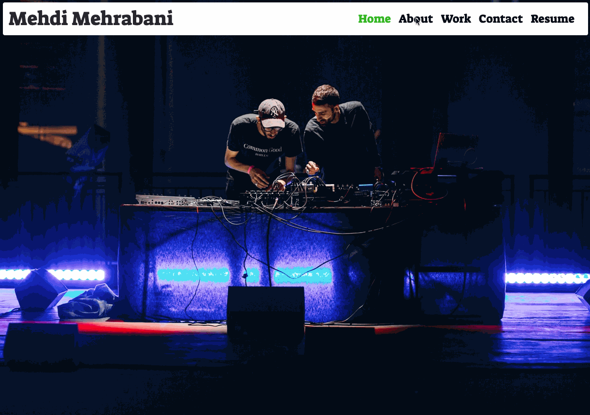

# curly-octo-guacamole

Assignment Summary: Portfolio Website Update #2

Developer: Mehdi Mehrabani

Portfolio Link: [Portfolio](https://mmehr1988.github.io/curly-octo-guacamole/)

For this weeks assignment, we were tasked with updating our initial portfolio website. The first time around, I was at the beginning of my bootcamp journey and there weren’t any projects to showcase. Since then, we've completed a handful of assignments and 1 group project that I’m proud of and want future employers to view.

# Summary of Assignment

## Resources Used:

1. Bootcamp
2. Udemy
3. GoogleDev Tools
4. Bootstrap
5. Jquery
6. Youtube
7. Stackoverflow

# Steps Taken to Complete Assignment

### Initial Steps

1. Review Homework Requirements
2. Choose CSS Framework
3. Choose Fonts & Color Theme
4. Gather Learning Material
5. Wireframing
6. Create Files & Structure Folder

## Homework Requirements

### Requirement #1: Update Portfolio To Showcase Bootcamp Coursework

1. Project 1: Digital Audio Harmonious Mixer

   a. Summary Of Project: DAHM is digital mixer app that uses four imported youtube videos and allows users to adjust video parameters to create unique sounds.

   b. Github Repo: symmetrical-waddle

   c. Github Repository Link: [symmetrical-waddle Repo](https://github.com/mmehr1988/symmetrical-waddle)

   d. Github App Link: [symmetrical-waddle App](https://mmehr1988.github.io/symmetrical-waddle/)

2. Assignment 1: Code Quiz

   a. Summary Of Project: A multiple choice app that cycles through questions and outputs a score based on the time taken to complete quiz.

   b. Github Repo: miniature-telegram

   c. Github Repository Link: [miniature-telegram Repo](https://github.com/mmehr1988/miniature-telegram)

   d. Github App Link: [miniature-telegram App](https://mmehr1988.github.io/miniature-telegram/)

3. Assignment 2: Weather Dashboard

   a. Summary: A weather app that allows users to input a city name and receive up to date weather data.

   b. Github Repo: legendary-meme

   c. Github Repository Link: [legendary-meme Repo](https://github.com/mmehr1988/legendary-meme)

   d. Github App Link: [legendary-meme App](https://mmehr1988.github.io/legendary-meme/)

4. Assignment 3: Work Day Scheduler

   a. Summary: A scheduler app that allows users to save personal notes for each hour of the day.

   b. Github Repo: automatic-doodle

   c. Github Repository Link: [legendary-meme Repo](https://github.com/mmehr1988/automatic-doodle)

   d. Github App Link: [legendary-meme App](https://mmehr1988.github.io/automatic-doodle/)

### Requirement #2: Update Github Profile

1. Update Github Profile Picture – Used an avatar as my profile picture.

2. Biography – I decided to state where in the coding world I place myself and what my passion in life is. The result being, “Full stack developer who loves telling stories with sound.”

3. Add Email + Portfolio Link – Under the biography section, I added my developer email and link to my portfolio.

4. Github Profile README – While researching unique profiles to get inspiration, I came across this process of using a README.md as a message board. I decided I wanted to implement the same for my project.

   a. Badges For Github README Profile: The below Github repo walks you through how to add badges to your profile page. Combining the badges with `<a>` links, you can create a clickable link that redirects users.

   b. [Welcome! Badges 4 README.md Profile](https://github.com/alexandresanlim/Badges4-README.md-Profile)

5. Historical Assignment File Updates – gitignore + MIT LICENSE

   a. gitignore: I recently learned the purpose of a gitignore file and how to ignore the macOS specific .DS_Store upon pushing repository updates. Having only included the file for our group project, I decided for consistency purposes to do the same for all previous repositories.

   b. MIT LICENSE: For the same reason as the gitignore file, I decided to go back and include the license for all previous assignments.

## CSS Framework: Bootstrap 5.0

Up until recently, I’ve forced myself to use pure CSS styling for all my work just to learn the blueprint of styling with pure CSS. However, with each passing week the assignments are demanding more time to be spent on the Javascript side and as a result I’ve had to start utilizing CSS frameworks to make up for the lost time.

For this iteration of my portfolio I’ve decided to go with Bootstrap 5.0. On their website getting started page, they have a download package with a bunch of templates that users can utilize as a starting point. Links below.

Bootstrap Website [Build fast, responsive sites with Bootstrap](https://getbootstrap.com/)

Bootstrap Getting Started Page [Download Page](https://getbootstrap.com/docs/5.0/getting-started/download/)

Bootstrap Template Download Link [Bootstrap Templates]](https://github.com/twbs/bootstrap/releases/download/v5.0.2/bootstrap-5.0.2-dist.zip)

## Choose Fonts & Color Theme

I’ve been using google fonts family “Suez One” styling for the past couple of assignments and for me it just gives a playful feel that I relate to.

1. NAV: For the NAV Bar, I used a white background and upon user hover over links, I used a light green `#1fb622`for the active link and a darker tone `#1a941c` for the hover effect.

2. Section Titles: For the section titles, I used a mustard yellow `#e3b505`.

3. About Content: I used a combo of pink `#ff007f` and green `#2ecc71` to highlight important text. For the remaining text I used the color white.

## File Structure

1. File: Index.html
2. File: LICENSE
3. File: README.md
4. Folder: assets

   a. Folder: css

   - File: style.css

   - File: queries.css

   b. Folder: documents

   - File: resume

   c. Folder: gifs

   - File: gif of portfolio

   d. Folder: img

   - Folder: avatar

     - File: A 200x200 avatar photo

   - Folder: work

     - project-1-DAHM.png
     - miniature-telegram.png
     - legendary-meme.png
     - automatic-doodle.png

   f. Folder: js

   - File: script.js

5. Folder: vendors

   - File: normalize.css

## Process Of Writing

1.  `<head>`

    - In the head of the document you will find the following `<link>`

      a. Bootstrap 5.0
      b. Jquery
      c. Google Fonts
      d. Normalize CSS
      e. style.css
      f. queries.css

2.  `<header>` + `<nav>`

    [A] NAV Links + Page Change

    - NAV Link Color + Page Change Functionality - I wrote a jQuery click event to listen to which element in the nav was clicked.

      - Step #1: Remove NAV Color + Hide Active Section Of Previous Active Section

        - `removeClass('navActiveLink')` - First step is to remove the class that is coloring the text.

        - `.addClass('hidden')` - The second step was to hide the section that was active prior to the click by adding class `hidden`

      - Step #2: Add NAV Color + Unhide Section Of Clicked Link

        - `$(this).addClass('navActiveLink')` - First step is to add the class that is coloring the text.

        - `$($(this).attr('href')).removeClass('hidden')` - The href of a navlink is the id of the section associated with that link. Once the id was pulled for the section, I removed the class `hidden` to unhide the section.

    - Resume Link - the last NAV Link is where users can view my resume. On click, a new tab will open in the browser.

3.  `<figure>`

    - For the background image I used the same photo as last time which showcases my brother and I playing for our residency at the TheShed.

    - Check out link for more info (https://theshed.org/program/103-open-call-saint-abdullah)

4.  Section: About

    - In the about section, I wanted to make sure the first few lines indicated I'm a full stack web developer. I also wanted to highlight the languages I'm versed in with the green color I wrote about earlier.

5.  Section: Work

    - Images For App Highlights - For this section I used images to showcase the projects I wanted to highlight in my portfolio.

    - Modal For Github Repo + Live App - I used modals to pop up for when users click on each image. The modal showcases the apps title, a short summary. At the bottom of each modal there are two links users can click on. First being the github reposity, and the second is the link to the live app.

6.  Section Contact:

- Email & Phone Number - I used a `
` element to provide my email and phone number

- Icons - I used icons to redirect users to the various platforms where they can contact me.

# GIF Of Final Portfolio Update #2

